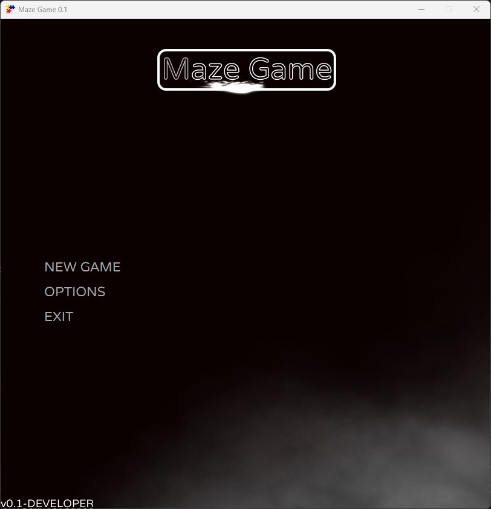
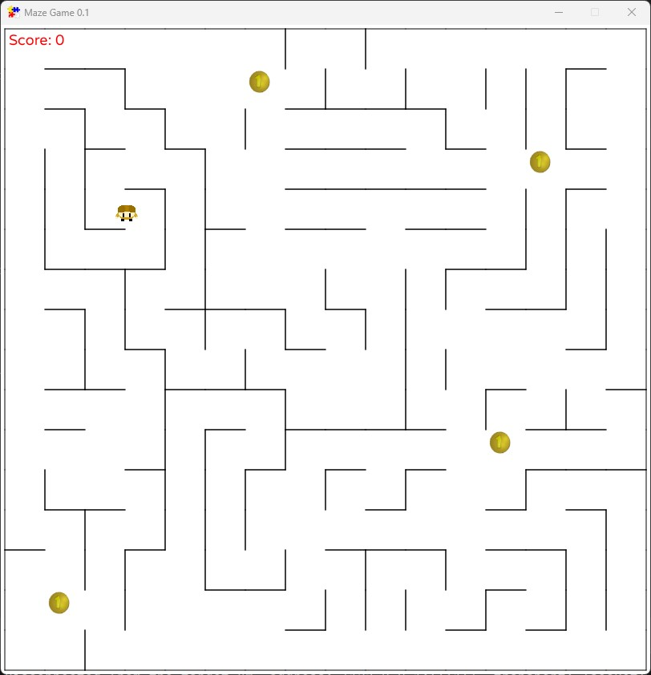

# Maze Game

## Description

This is a simple maze game project that built using the JavaFX with the FXGL game library. Players navigate through a dynamically generated maze and collect coins. The game features an intuitive control scheme, a timer to track how quickly the maze is completed, and a scoring system to enhance the gameplay experience.

## How to Play

- **Objective**: Navigate through the maze to collect all coins as quickly as possible.
- **Starting the Game**: Upon launching the game, press the 'Start' button to begin.
- **Completion**: The game concludes when all coins are collected. Your score is displayed, and you have the option to play again.

## Key Bindings

- `W`: Move Up
- `S`: Move Down
- `A`: Move Left
- `D`: Move Right
- `ESC`: Pause the game or access the game menu

## Running the Project

This project uses the Gradle build system. To run the game, follow these steps:

1. Navigate to the project's root directory.
2. Run the game using the Gradle wrapper:

    For Windows:
    
    ```shell
    .\gradlew run
    ```
    
    For macOS/Linux:
    
    ```shell
    ./gradlew run
    ```

## Reflection

Reflecting on the process of building this maze game, the most enjoyable part was seeing the game come to life from scratch—particularly the maze generation algorithm, which was both a challenge and a thrill to implement.
When I first embarked on creating this maze game, I initially considered using the Swing framework.
However, I quickly realized that it might prove too cumbersome for what I had in mind, prompting me to explore other options. 
That's when I stumbled upon JavaFX, and shortly after, discovered FXGL—a game development framework built on top of JavaFX. 
I learned FXGL very quickly then I started developing my maze game. Initially, I toyed with the idea of using a linked list to structure the maze but found that approach became impractical with larger mazes. 
Eventually, I settled on a 2D array matrix, which significantly streamlined the maze generation process, despite the initial challenge of programming the maze walls to generate in a random yet coherent manner.

I have extensive experience building games using languages such as TypeScript and C#. 
However, delving into Java for game development was a new frontier for me. 
Up until this point, my experience with Java was limited to academic projects, which hardly pushed the envelope of what I knew was possible with the language. 
Working on this maze game not only expanded my understanding of Java but also introduced me to the robust capabilities of FXGL. 
The project was a whirlwind of learning and creativity, blending my existing knowledge with new challenges and requiring me to adapt and grow. 
Reflecting on this journey, I'm amazed at how much I was able to learn in such a short period.


## Sample Screenshots


